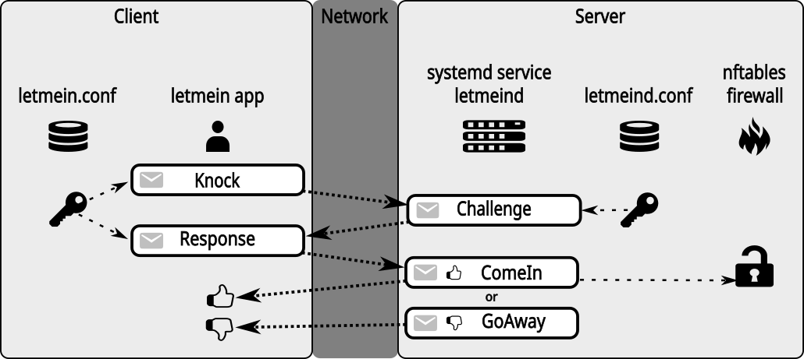

# letmein - Authenticated port knocking

Letmein is a simple port knocker with a simple and secure authentication mechanism.
It can be used to harden against pre-authentication attacks on services like SSH, VPN, IMAP and many more.

Letmein hides services on a server behind a knock authentication barrier to reduce the attack surface of a service.
The service will not be accessible unless a knock authentication is successful.
In case of a successful knock, the letmeind server will only open the knocked port for the client IP address that performed the knocking.
Machines with different IP addresses still won't have access to the protected service.

Machines that can't successfully authenticate the knock sequence won't be able to access the protected service.
They will receive a ICMP `reject` on the protected service port with the provided example [nftables.conf](doc/nftables.conf).
(You can also decide to `drop` the packets in your `nftables.conf` instead).

Letmein requires an `nftables` based firewall.
It will *not* work with `iptables`.
If you use an `iptables` based firewall, please convert to `nftables` before installing letmein.
There are descriptions about how to do that on the Internet.
It's not as hard and as much work as it sounds. :)

The letmein control communication itself defaults to TCP port 5800, but it can be configured to any TCP or UDP port.
If you choose a UDP port as control port and configure [control-error-policy=basic-auth](doc/CONFIGURATION.md#control-error-policy), then the letmein service itself operates in stealth mode and doesn't respond to unauthenticated incoming messages.

## Typical letmein operation flow



## Network protocol and cryptography

A detailed description of the wire protocol and the cryptography used can be found in the [protocol documentation](doc/PROTOCOL.md)

## Project links

[Homepage](https://bues.ch/h/letmein)

[Git repository](https://bues.ch/cgit/letmein.git)

[Github repository](https://github.com/mbuesch/letmein)

## Usage example: Put OpenSSH (sshd) access behind a knock authentication barrier

On the server install the letmein server software (see sections below).

On the client install the letmein client software (see sections below).

Please read the [nftables.conf](doc/nftables.conf) example configuration file provided with this project.
Adding a letmein specific input chain to your existing `nftables` configuration is required.
Modify your `nftables.conf` accordingly.

Generate shared secret key and a user identifier to be installed on the server and client with the following client command:

```sh
letmein gen-key -u 00000000
```

The gen-key command will print the generated key string to the console.
By default this will generate a secure random key for the user identifier `00000000`.
You can manually edit the user identifier, if you want, or you can just leave it as-is.

Add the generated string (user identifier and the shared secret) to the server configuration in `/opt/letmein/etc/letmeind.conf`.
Put the generated key string together with the user identifier into the `[KEYS]` section of the configuration file.

Add the same generated string (user identifier and shared secret) to the client configuration in `/opt/letmein/etc/letmein.conf`.
Put the generated key string together with the user identifier into the `[KEYS]` section of the configuration file.

Create a `resource` in the server that describes the `sshd` port that can be opened.
In the `[RESOURCES]` section of the server configuration file `/opt/letmein/etc/letmeind.conf` all ports that may be opened must be specified. A resource consists of a resource identifier followed by a port identifier like that:

```
[RESOURCES]
00000022 = port: 22
```

The resource identifier is an 8 digit hexdecimal number. In this example it is 22(hex), but it can be any number. It just has to be the same number on the server and the client. After `port:` the port number (in decimal) that can be knocked-open is specified.

Add the same resource with the same resource identifier and the same port number to the client configuration in `/opt/letmein/etc/letmein.conf`.

Restart the letmein server:

```sh
systemctl restart letmeind.service
```

Now remove your static `sshd` port (22) `accept` from your `nftables.conf` firewall configuration.
Letmein will install such a rule dynamically into the letmein input chain after successful knock authentication.
Then restart nftables:

```sh
systemctl restart nftables.service
```

Done! You should now be able to knock-open the `sshd` port on your server:

```sh
# This must fail! No successful knock authentication, yet.
# If this does not fail, check if you have removed the sshd accept rule from nftables.conf.
ssh your-server.com

# Knock-open port 22 (sshd) on the server using user-id/key 00000000:
# (You do not have to specify -u 00000000 if that is your default user (see config).)
letmein knock -u 00000000 your-server.com 22

# Now you should be able to ssh into your server successfully:
ssh your-server.com

# When you're done, you can close the port manually for increased security:
letmein close -u 00000000 your-server.com 22
```

To automatically knock the port before connecting with ssh, you can add a `Match exec` rule to your `~/.ssh/config` file:

```
Match host your-server.com exec "letmein knock -u 00000000 your-server.com 22"
```

You can also add automation to close the port after your SSH session ends by using a SSH configuration like this:

```
Match host your-server.com
    ExitOnForwardFailure yes
    PermitLocalCommand yes
    RemoteCommand bash -c "trap 'sleep 1; letmein close -u 00000000 localhost 22 &' EXIT; bash -l"
```

## Installing

See the [installation instructions](doc/INSTALL.md) for more information about how to build and install letmein.

## Uninstalling

If you want to completely remove letmein from your system, see the [uninstall instructions](doc/INSTALL.md#uninstalling).

## Platform support

### Client

The client application `letmein` is portable and should run on all major platforms.
Tested platforms are:

- Linux
- Android, under [Termux](https://termux.dev/)
- Windows
- MacOS (build tested only)

### Server

The server application `letmeind` is Linux-only, because it only supports `nftables` as firewall backend.

## Configuration

See the [configuration documentation](doc/CONFIGURATION.md) for detailled information about how to configure the letmein server and client.

## Security notice: User identifiers and resource identifiers

Please be aware that the user identifiers and resource identifiers from the configuration files are transmitted over the network without encryption in clear text.

Make sure the user identifiers and resource identifiers do **not** include any private information.

These identifiers are merely meant to be an abstract identification for managing different `letmein` keys, installations and setups.

See the documentation about [keys](doc/CONFIGURATION.md#keys) and [resources](doc/CONFIGURATION.md#resources) for detailled information.

## Internals and design goals

The main design goals of letmein are:

- It is implemented in a memory-safe programming language that makes certain classes of severe bugs impossible.
- The algorithms and implementation are as simple as reasonably possible.
- It does not implement complicated cryptographic algorithms such as asymmetric public/private key crypto. It uses a shared secret together with HMAC/SHA3 for authentication instead.
- It has a replay protection. Replaying a knock packet sequence does not result in a successful authentication.
- It only opens the port for the IP address that made the knock request. By default for both IPv4 and IPv6, if available. This behavior can be adjusted with the `-4` and `-6` client command line options.
- letmein does not link to libraries (.so) written in unsafe languages, except for the ones required by the operating system or by the Rust compiler. The only dynamically linked libraries are:
  - libc.so
  - libm.so
  - libgcc_s.so
  - linux-vdso.so
  - ld-linux-*.so
  - ld-android.so (Android only)
  - libdl.so (Android only)
  - libarmmem-*.so (Raspberry Pi only)

# Security

For more information about security and reporting vulnerabilities, please see the [security documentation](SECURITY.md) of letmein.


# Distribution packaging

If you want to package the software for distribution, please see the [distribution packaging hints](doc/DISTRO_PACKAGING.md).

# Development

## Contribution guidelines

- All code comments and documentation should be written in English for consistency and accessibility.
- If you find any non-English content in the codebase, please consider translating it to English before submitting a pull request.

# License

Copyright (c) 2024-2025 Michael Büsch <m@bues.ch>

Licensed under the Apache License version 2.0 or the MIT license, at your option.
